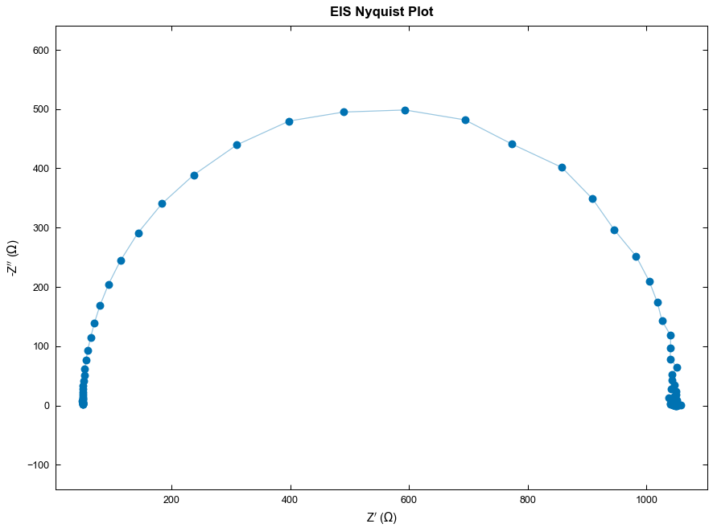
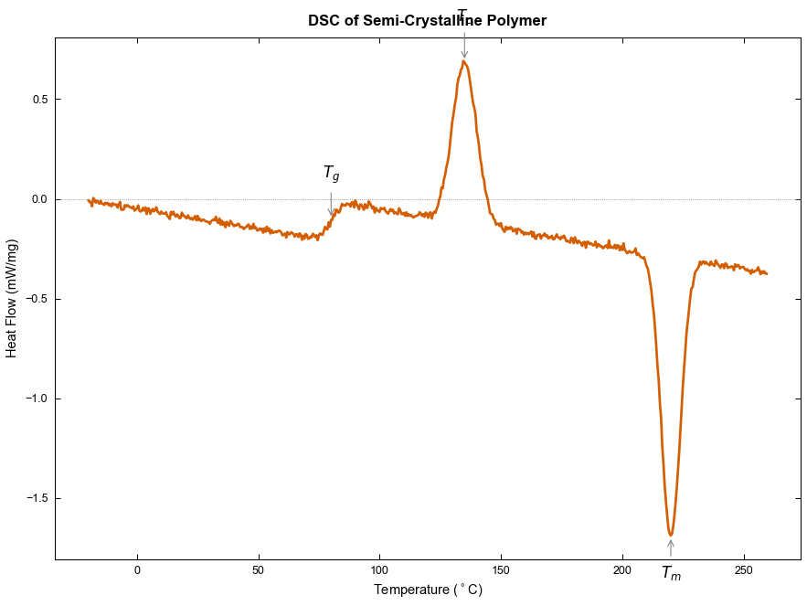
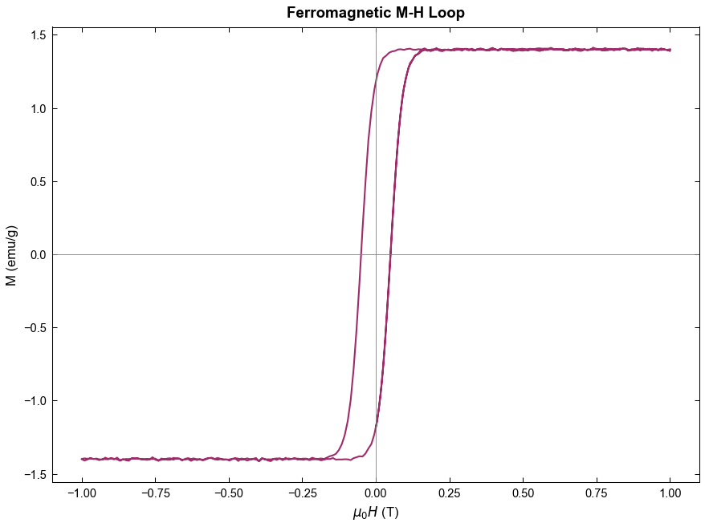
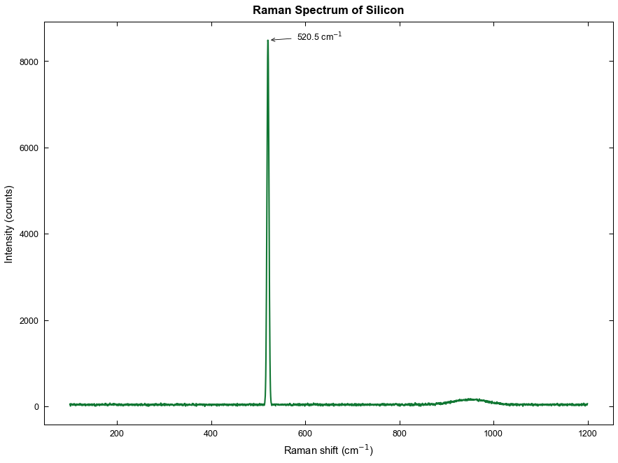
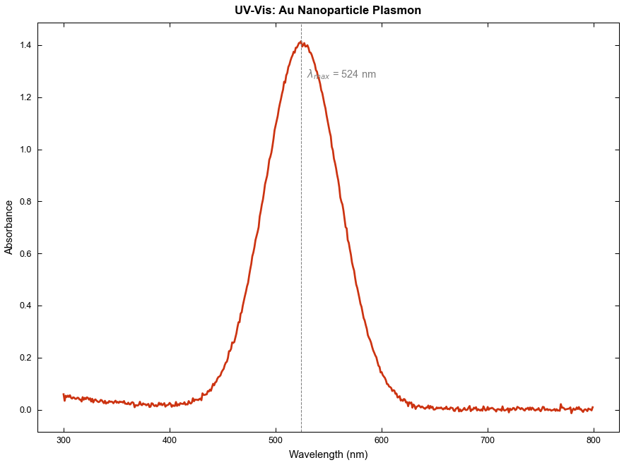
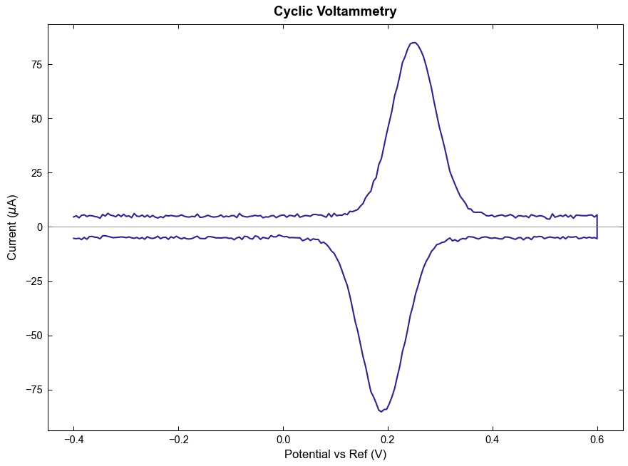

# Praxis


[](LICENSE)
[](https://www.python.org)
[](https://github.com/zmtsikriteas/praxis/actions/workflows/tests.yml)
[](https://github.com/zmtsikriteas/praxis/pulls)

**Scientific data analysis and publication-quality plotting for 50+ characterisation techniques.**

Load raw lab data in any of 16 formats, run technique-aware analysis, and produce journal-ready figures in nine journal styles -- all from a few lines of Python. Praxis (Greek *praxis*: practice, action) handles the boring parts of every characterisation workflow so you can focus on the science.

## Install

```bash
pip install praxis-sci
```

Or install the development version from source:

```bash
git clone https://github.com/zmtsikriteas/praxis.git
cd praxis
pip install -e .
```

## 30-second example

Every technique ships with a built-in sample dataset, so you can try Praxis without supplying your own data:

```python
from praxis.core.loader import load_sample
from praxis.core.utils import apply_style
from praxis.core.plotter import plot_data
from praxis.techniques.xrd import analyse_xrd

df = load_sample("xrd")                                       # built-in Si pattern
results = analyse_xrd(df["two_theta_deg"], df["intensity"],
                      wavelength="Cu_Ka")                     # peak ID + Scherrer

apply_style("nature")                                          # 89 mm column, Arial 7pt
fig, ax = plot_data(df["two_theta_deg"], df["intensity"],
                    xlabel=r"$2\theta$ (deg)",
                    ylabel="Intensity (a.u.)")
fig.savefig("xrd.png", dpi=300)
```

`list_samples()` prints all 25 available datasets (one per technique).

## Gallery

Each tile is a complete figure produced by Praxis: real journal style, real analysis output, real annotations.

<table>
  <tr>
    <td width="33%"><br><sub><b>XRD with peak labels</b> &middot; Nature</sub></td>
    <td width="33%"><br><sub><b>Tensile test, E and UTS</b> &middot; Elsevier</sub></td>
    <td width="33%"><br><sub><b>Gaussian fit + 95% CI</b> &middot; RSC</sub></td>
  </tr>
  <tr>
    <td><br><sub><b>Raw / FFT / filtered</b> &middot; IEEE</sub></td>
    <td><br><sub><b>Multi-panel figure</b> &middot; Science</sub></td>
    <td><br><sub><b>2D contour map</b> &middot; Springer</sub></td>
  </tr>
  <tr>
    <td><br><sub><b>EIS Nyquist plot</b> &middot; ACS</sub></td>
    <td><br><sub><b>DSC: Tg / Tc / Tm</b> &middot; Wiley</sub></td>
    <td><br><sub><b>Ferromagnetic M-H loop</b> &middot; MDPI</sub></td>
  </tr>
  <tr>
    <td><br><sub><b>Raman of silicon</b> &middot; Nature</sub></td>
    <td><br><sub><b>UV-Vis Au plasmon</b> &middot; Wiley</sub></td>
    <td><br><sub><b>Cyclic voltammetry</b> &middot; IEEE</sub></td>
  </tr>
</table>

All 12 figures are reproduced by `python examples/generate_examples.py`.

## Features

- **21 technique modules** with domain-specific analysis (Scherrer/Williamson-Hall for XRD, Tg/Tm/crystallinity for DSC, Tauc/Beer-Lambert for spectroscopy, Shirley/peak fits for XPS, equivalent-circuit fitting for EIS, and more).
- **16 data formats** auto-detected: CSV, TSV, TXT, Excel, JSON, .xy, .dat, .asc, .spe, JCAMP-DX, HDF5, MATLAB .mat, Bruker .brml, Gamry .dta, clipboard, plus BOM/UTF-16 and European decimal-comma handling.
- **15+ plot types** including line, scatter, bar, errorbar, histogram, box/violin, contour, heatmap, polar, waterfall, ternary, Smith chart, broken axis, multi-panel.
- **9 journal styles** matching column widths, fonts, and DPI requirements: Nature, Science, ACS, Elsevier, Wiley, RSC, Springer, IEEE, MDPI.
- **Colourblind-safe palettes** by default: Okabe-Ito, Tol, uchu (perceptually uniform).
- **Reproducible exports** in PNG/SVG/PDF/EPS/TIFF, each with a `.meta.json` sidecar capturing the parameters used.
- **Batch processing** of hundreds of files with a single pipeline; analysis templates save and replay pipelines on new data.
- **25 built-in sample datasets** so every cookbook recipe is copy-paste runnable.

## Supported techniques

| Category          | Techniques                                                                |
|-------------------|---------------------------------------------------------------------------|
| Structural        | XRD, SAXS / SANS / WAXS                                                   |
| Microscopy        | SEM (grain size, porosity), EDS / EDX, AFM (roughness, profiles)          |
| Spectroscopy      | FTIR, Raman, UV-Vis, XPS, NMR, mass spectrometry                          |
| Thermal           | DSC, TGA, DMA                                                             |
| Mechanical        | Tensile, compression, nanoindentation, Vickers / Rockwell / Brinell hardness |
| Electrical        | I-V, C-V, EIS, four-point probe, solar-cell J-V                           |
| Magnetic          | VSM / SQUID M-H loops, Curie temperature, Langevin fit                    |
| Porosity          | BET surface area, BJH pore distribution                                   |
| Chromatography    | GC, HPLC, IC, SEC                                                         |
| Dielectric        | Permittivity, loss tangent, Cole-Cole, Curie-Weiss                        |
| Piezoelectric     | P-E loops, S-E butterfly, impedance resonance                             |
| Thermal transport | Laser flash, steady-state conductivity                                    |

## Documentation

| Doc                                              | Contents                                                                  |
|--------------------------------------------------|---------------------------------------------------------------------------|
| [Cookbook](docs/cookbook.md)                     | 50+ worked examples, one per technique: data, analysis, plot, expected output |
| [Workflows](docs/workflows.md)                   | 12 complete multi-step pipelines from raw data to publication figure      |
| [Plot types](docs/plot-types.md)                 | All 15+ plot types with runnable code                                     |
| [Techniques](docs/techniques.md)                 | Quick reference for every supported technique with expected data columns  |
| [Journal styles](docs/journal-styles.md)         | Column widths, fonts, DPI for 9 journals                                  |
| [Colour palettes](docs/colour-palettes.md)       | Okabe-Ito, Tol, uchu palettes with hex codes                              |

## Use as a Claude Code skill

Praxis was built to also work as a Claude Code skill. Sync the repository to your Claude skills folder and you get natural-language slash commands:

```
/praxis:plot         Create any plot from data
/praxis:fit          Curve fitting (10+ models + custom equations)
/praxis:peaks        Peak detection, fitting, deconvolution
/praxis:baseline     Baseline correction (polynomial, ALS, Shirley, SNIP)
/praxis:fft          FFT, power spectrum, filtering
/praxis:smooth       Savitzky-Golay, Gaussian, median, Whittaker
/praxis:stats        Descriptive stats, t-test, ANOVA, regression
/praxis:batch        Process multiple files with the same pipeline
/praxis:template     Save / load analysis pipelines
/praxis:report       Auto-generate analysis summary
/praxis:xrd          XRD analysis (Scherrer, Williamson-Hall)
/praxis:impedance    EIS (Nyquist, Bode, circuit fitting)
/praxis:dsc          DSC / TGA analysis
/praxis:mechanical   Stress-strain, DMA
/praxis:spectro      FTIR / Raman / UV-Vis
/praxis:xps          XPS peak fitting
/praxis:style        Set journal style
/praxis:export       Publication-quality export
/praxis:help         Show all commands
```

See [`SKILL.md`](SKILL.md) for the full skill definition.

## Development

```bash
git clone https://github.com/zmtsikriteas/praxis.git
cd praxis
pip install -e .[test]
python -m pytest tests/ -v
```

105 tests run on every push to main on Python 3.10, 3.11, and 3.12 (see [Actions](https://github.com/zmtsikriteas/praxis/actions)).

## Contributing

See [`CONTRIBUTING.md`](CONTRIBUTING.md) for setup, conventions, the
five-step recipe for adding a new technique, and how to add a new file
format. New techniques and vendor file-format parsers are the
highest-leverage contributions.

What's changed and what's coming: [`CHANGELOG.md`](CHANGELOG.md).

## Cite

If you use Praxis in research, please cite it via the **Cite this repository** button on the GitHub page (or see [`CITATION.cff`](CITATION.cff)).

## License

[MIT](LICENSE).
