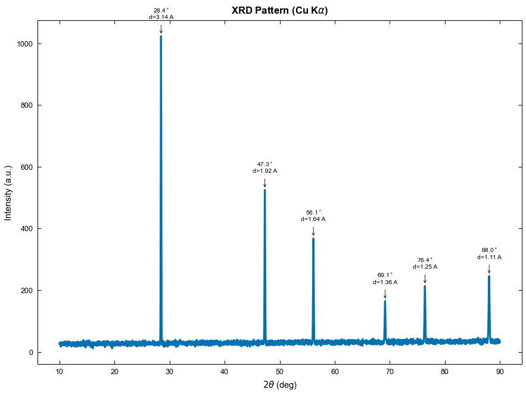
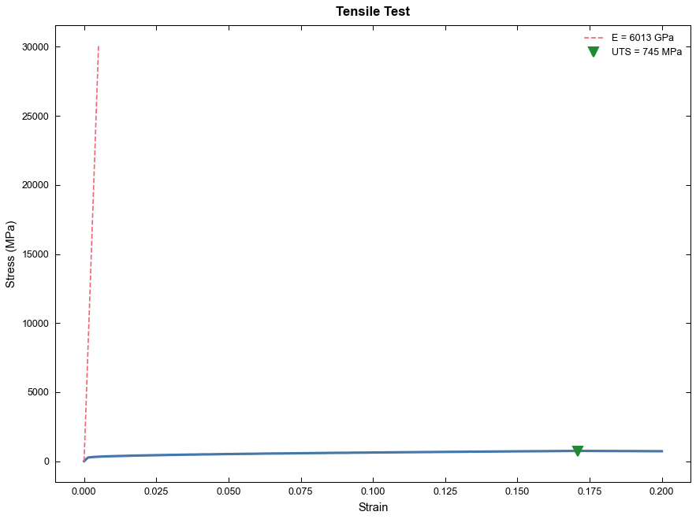
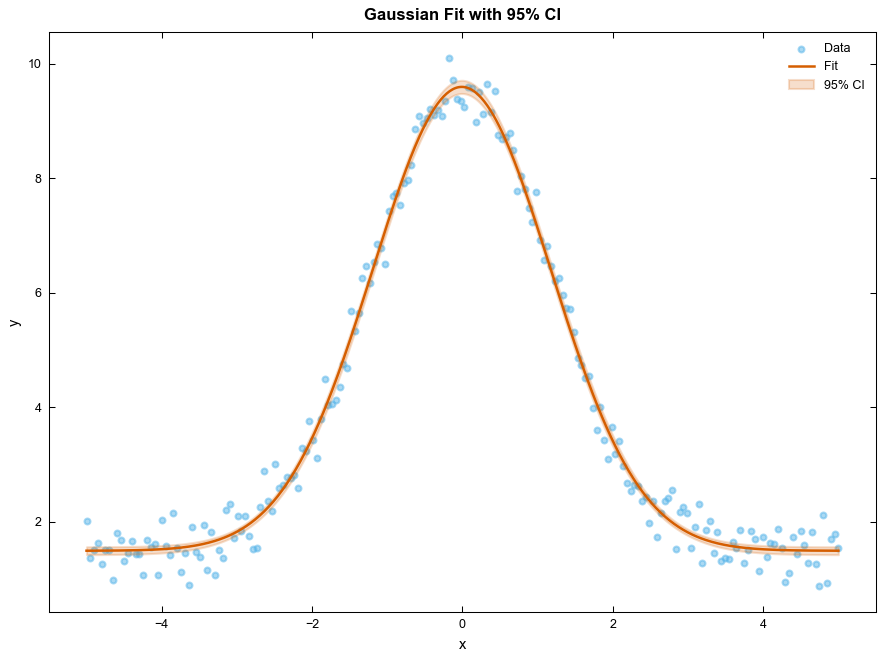
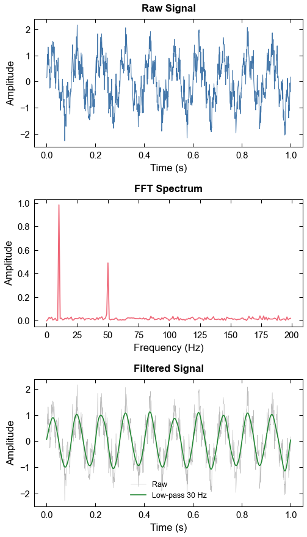
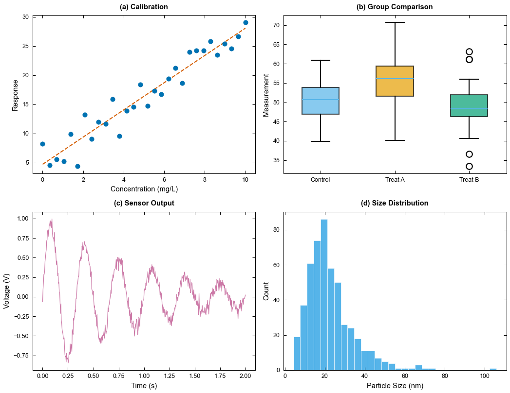
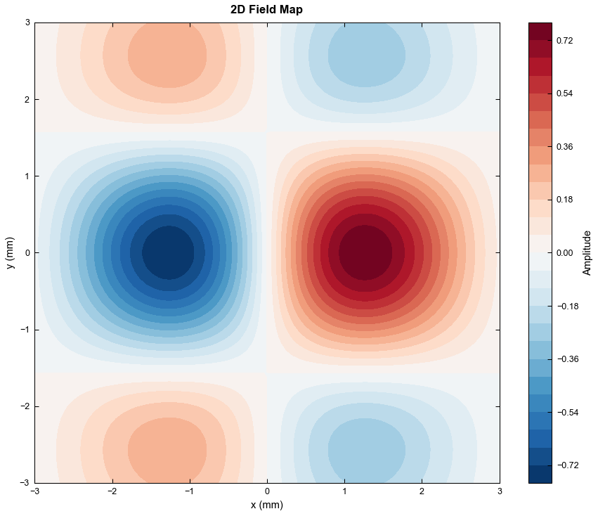

# Praxis


Scientific data analysis and publication-quality plotting.

Praxis (from Greek *praxis*, practice, action) gives researchers a natural-language interface for every characterisation technique they encounter in the lab. Load raw data, run technique-aware analysis, and produce journal-ready figures.

## Examples

### XRD pattern with peak labelling (Nature style)



### Tensile test with modulus and UTS annotation (Elsevier style)



### Gaussian curve fit with 95% confidence band (RSC style)



### Signal processing: raw, FFT, filtered (IEEE style)



### Multi-panel publication figure (Science style)



### 2D contour field map (Springer style)



## What It Does

- 36 Python modules covering 50+ characterisation techniques
- 21 dedicated technique modules with domain-specific analysis
- 16 data formats supported with auto-detection
- 15+ plot types including specialised scientific plots
- 9 journal styles (Nature, Science, ACS, Elsevier, Wiley, RSC, Springer, IEEE, MDPI)
- Colourblind-safe palettes by default (Okabe-Ito, Tol, uchu)
- Batch processing across hundreds of files
- Analysis templates: save pipelines, replay on new data
- Auto-generated reports in Markdown

## Supported Techniques

| Category | Techniques |
|----------|-----------|
| Structural | XRD, SAXS/SANS/WAXS |
| Microscopy | SEM (grain size, porosity), EDS/EDX, AFM (roughness, profiles) |
| Spectroscopy | FTIR, Raman, UV-Vis, XPS, NMR, mass spectrometry |
| Thermal | DSC, TGA, DMA |
| Mechanical | Tensile, compression, nanoindentation, hardness (Vickers/Rockwell/Brinell) |
| Electrical | I-V curves, C-V, impedance (EIS), four-point probe, solar cell J-V |
| Magnetic | VSM/SQUID M-H loops, Curie temperature, Langevin fit |
| Porosity | BET surface area, BJH pore distribution |
| Chromatography | GC, HPLC, IC, SEC |
| Dielectric | Permittivity, loss tangent, Cole-Cole, Curie-Weiss |
| Piezoelectric | P-E loops, S-E butterfly, impedance resonance |
| Thermal transport | Laser flash, steady-state conductivity |

## Quick Start

### Installation

```bash
pip install praxis-sci
```

Or install the latest development version from a clone:

```bash
git clone https://github.com/zmtsikriteas/praxis.git
cd praxis
pip install -e .
```

### Try it without your own data

Praxis ships 25 built-in sample datasets, one per technique. Test any
recipe immediately:

```python
from praxis.core.loader import load_sample, list_samples
from praxis.techniques.xrd import analyse_xrd

print(list_samples())                        # see all available samples
df = load_sample("xrd")                      # built-in Si pattern
results = analyse_xrd(df["two_theta_deg"], df["intensity"],
                      wavelength="Cu_Ka")
```

### In Python Scripts

```python
from praxis.core.loader import load_data
from praxis.core.plotter import plot_data
from praxis.core.exporter import export_figure
from praxis.core.utils import apply_style
from praxis.analysis.fitting import fit_curve
from praxis.techniques.xrd import analyse_xrd

# Load data
df = load_data("my_xrd_scan.csv")

# Analyse
results = analyse_xrd(df["2theta"], df["intensity"], wavelength="Cu_Ka")

# Plot
apply_style("nature")
fig, ax = plot_data(
    df["2theta"], df["intensity"],
    kind="line",
    xlabel="2theta (deg)",
    ylabel="Intensity (a.u.)",
    title="XRD Pattern",
)

# Export
export_figure(fig, "xrd_pattern.svg", dpi=300, output_dir="figures")
```

## Commands

```
/praxis:plot        Create any plot from data
/praxis:fit         Curve fitting (10+ models + custom equations)
/praxis:peaks       Peak detection, fitting, deconvolution
/praxis:baseline    Baseline correction (polynomial, ALS, Shirley, SNIP)
/praxis:fft         FFT, power spectrum, filtering
/praxis:smooth      Savitzky-Golay, Gaussian, median, Whittaker
/praxis:stats       Descriptive stats, t-test, ANOVA, regression
/praxis:batch       Process multiple files with same pipeline
/praxis:template    Save/load analysis pipelines
/praxis:report      Auto-generate analysis summary
/praxis:xrd         XRD analysis (Scherrer, Williamson-Hall)
/praxis:impedance   EIS (Nyquist, Bode, circuit fitting)
/praxis:dsc         DSC/TGA analysis
/praxis:mechanical  Stress-strain, DMA
/praxis:spectro     FTIR/Raman/UV-Vis
/praxis:xps         XPS peak fitting
/praxis:style       Set journal style
/praxis:export      Publication-quality export
/praxis:help        Show all commands
```

## Data Formats

Auto-detected: CSV, TSV, TXT, Excel (.xlsx/.xls), JSON, .xy, .dat, .asc, .spe, JCAMP-DX (.jdx/.dx), HDF5 (.h5/.hdf5), MATLAB (.mat), Bruker XRD (.brml), Gamry (.dta), clipboard.

## Journal Styles

Each `.mplstyle` file matches journal requirements (column widths, font sizes, tick directions, DPI):

```python
from core.utils import apply_style
apply_style("nature")   # 89mm single column, Arial 7pt, 300dpi
apply_style("acs")      # 3.25in column, Arial 6pt
apply_style("science")  # 90mm column, Helvetica 6pt
```

## Colour Palettes

All palettes are colourblind-safe:

- Okabe-Ito (default): 8 colours, widely used in scientific publishing
- Tol Bright / Tol Muted: Paul Tol's optimised palettes
- uchu: perceptually uniform OKLCh palettes (8 categorical + 9 sequential sub-palettes)

```python
from core.utils import set_palette
set_palette("uchu")        # Categorical: blue, red, green, yellow, purple, orange, pink, grey
set_palette("uchu_blue")   # Sequential: 9 shades light-to-dark
```

## Documentation

- [Cookbook](docs/cookbook.md): 50+ worked examples, one per technique
- [Workflows](docs/workflows.md): 12 complete multi-step pipelines
- [Plot Types](docs/plot-types.md): all plot types with code examples
- [Techniques](docs/techniques.md): quick reference for every technique
- [Journal Styles](docs/journal-styles.md): formatting specs for 9 journals
- [Colour Palettes](docs/colour-palettes.md): palette reference with hex codes

## Project Structure

```
praxis/
├── SKILL.md
├── pyproject.toml
├── praxis/                 the importable Python package
│   ├── core/               loader, plotter, exporter, utils
│   ├── analysis/           fitting, peaks, baseline, smoothing, fft, stats,
│   │                       interpolation, normalisation, templates, report
│   ├── techniques/         21 technique-specific modules
│   ├── styles/             9 journal .mplstyle files
│   └── batch/              batch processing
├── docs/             user documentation
└── tests/                  95 tests + sample data
```

## Dependencies

```
numpy >= 1.24
scipy >= 1.10
pandas >= 2.0
matplotlib >= 3.7
lmfit >= 1.2
peakutils >= 1.3
openpyxl >= 3.1
uncertainties >= 3.1
```

Optional: `h5py` (HDF5 files), `Pillow` (TIFF export)

## Tests

```bash
pip install pytest
python -m pytest tests/ -v
```

95 tests covering all core modules, analysis functions, and technique modules.

## Contributing

Contributions welcome. To add a new technique:

1. Create `praxis/techniques/your_technique.py`
2. Follow the existing pattern: dataclass results, analysis functions, summary table printing
3. Add the slash command to `SKILL.md`
4. Add a cookbook entry to `docs/cookbook.md`
5. Add tests to `tests/`

## License

MIT
